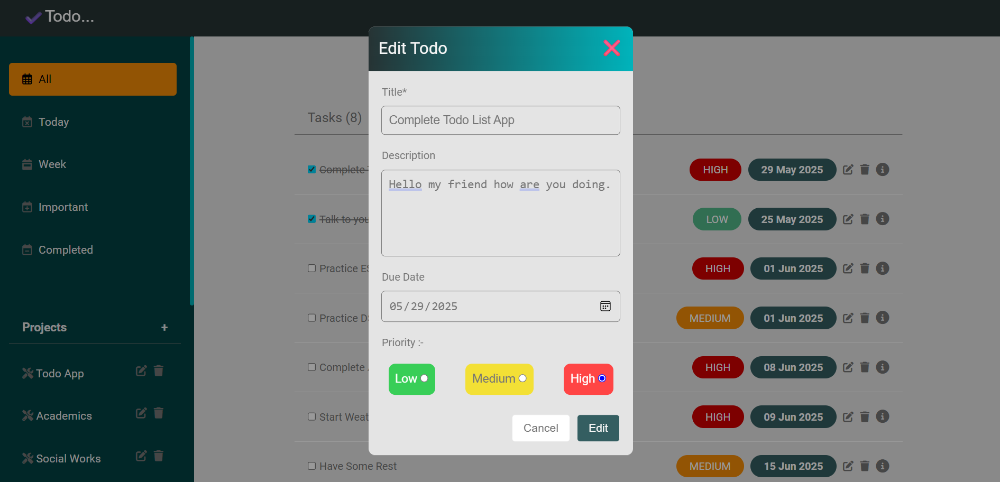

# 📝 Todo List App

A feature-rich, modular, and responsive Todo List web application built from scratch using vanilla JavaScript and Webpack. Designed to help you stay organized with multiple views, editable tasks, and clean UI — all fully keyboard accessible.


## 🔍 Features

- ✅ Add, delete, and mark todos as completed
- 🗂️ Create and manage multiple projects
- 🖊️ Edit todos and projects anytime
- 📁 Today, Week, Important, Completed, and All — separate tabs for clear task view
- ❓ Confirm before deleting any todo or project
- 🌐 Clean and responsive UI with mobile-friendly toggle menu
- ⌨️ Fully keyboard accessible
    - autofocus on input
    - Press Enter to add
    - Press Escape to cancel
- ⚡ Optimized with Webpack for faster performance
- 📆 Local date formatting using date-fns library

## 📸 Preview



## 🚀 Live Demo

👉 [Try it now](https://organized-life-todo.netlify.app/)

## 🛠️ Tech Stack

- JavaScript (ES6+)
- HTML5 + CSS3
- Webpack (modular build system)
- date-fns for clean date handling


## 📚 What I Learned

This was my first complex JavaScript project built completely on my own. Here's what I gained:

- ✨ Mastered modular JS structure and Webpack bundling
- 🧠 Deep understanding of DOM manipulation, event delegation, and project architecture
- 🧪 Spent over 5 days debugging — improved my problem-solving and code clarity
- 💡 Took help from AI for conceptual hints (like how to edit), but wrote and implemented all logic myself
- 🎨 UI inspiration from external references, but fully customized and integrated
- 📱 Understood responsive design better with toggle menus and mobile-first styling
- 💪 Built stronger confidence in JavaScript — this project pushed me hard, but now I feel levels ahead of where I was 10 days ago!


## 🚧 Setup & Run Locally
```bash
git clone https://github.com/YashRTech/Todo-List.git
cd Todo-List
npm install
npm run build
```

Then open dist/index.html in your browser.

## 📦 Deployment
- Built using Webpack, deployed via Netlify.
- Publish folder: dist/
- Build command: npm run build


## 🧠 Learnings
- Modular JS structure with Webpack
- DOM manipulation for dynamic UI
- Managing state and localStorage
- Responsive and accessible design


## 📜 License
MIT